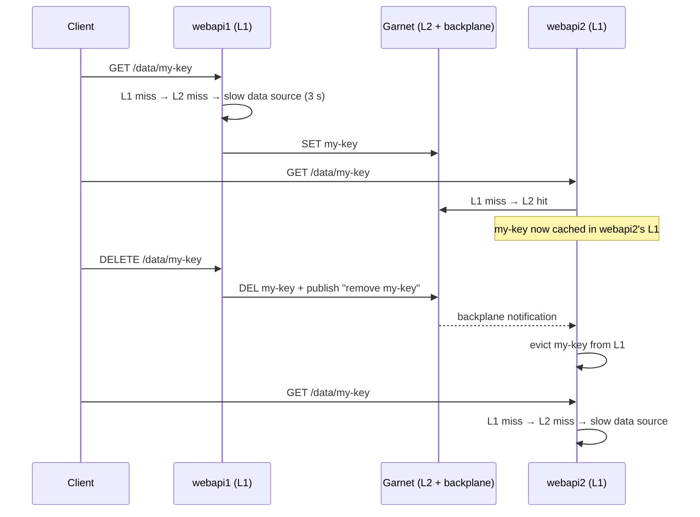

# CacheInvalidation

[](https://github.com/lscchnh/dotnet-cache-invalidation/actions/workflows/ci.yml)

A proof of concept showing how to **propagate cache invalidation between several instances of an API that each have their own in-memory cache**.

It uses [FusionCache](https://github.com/ZiggyCreatures/FusionCache), a .NET hybrid cache that combines:

- **L1**: an in-memory cache local to each instance (very fast, but each instance has its own copy),
- **L2**: a distributed cache shared by every instance, here [Garnet](https://github.com/microsoft/garnet) (Microsoft's Redis-compatible server),
- **a backplane**: a Redis pub/sub channel that tells the other instances to evict their L1 copy whenever an entry is set, removed or expired.

The whole thing is orchestrated with [Aspire](https://aspire.dev).

## How it works



Without the backplane, `webapi2` would keep serving the stale value from its L1 until it expires (1 minute here).

## Solution structure

| Project | Role |
| --- | --- |
| `CacheInvalidation.AppHost` | Aspire AppHost: starts Garnet, Redis Insight and two instances of the WebApi. |
| `CacheInvalidation.WebApi` | Minimal API exposing the cached data, configured with FusionCache (L1 + L2 + backplane). |
| `CacheInvalidation.ServiceDefaults` | Shared Aspire defaults: OpenTelemetry, health checks, service discovery, resilience. |
| `CacheInvalidation.Tests` | In-process tests (no container needed) and end-to-end tests against the AppHost. |

## Prerequisites

- [.NET 10 SDK](https://dotnet.microsoft.com/download/dotnet/10.0)
- A container runtime: [Docker Desktop](https://www.docker.com/products/docker-desktop/) or [Podman](https://podman.io/)
- Optional: the [Aspire CLI](https://aspire.dev/get-started/install-cli/)

## Getting started

With the Aspire CLI:

```bash
aspire run
```

Or with the .NET CLI:

```bash
dotnet run --project CacheInvalidation.AppHost
```

In Visual Studio or Rider, open `CacheInvalidation.slnx`, set `CacheInvalidation.AppHost` as the startup project and run the `https` profile.

The Aspire dashboard opens and shows:

| Resource | Description | URL |
| --- | --- | --- |
| `garnet` | Garnet server (L2 + backplane) | `localhost:6379` |
| `garnet-insight` | Redis Insight, pre-connected to Garnet, to browse the L2 entries | link in the dashboard |
| `webapi1` | First API instance, with its Scalar UI | https://localhost:5001/scalar |
| `webapi2` | Second API instance, with its Scalar UI | https://localhost:5002/scalar |

## Try it

The easiest way is [CacheInvalidation.WebApi.http](CacheInvalidation.WebApi/CacheInvalidation.WebApi.http), which runs the full scenario from Visual Studio, Rider or VS Code (REST Client). You can also use the Scalar UI of each instance.

1. `GET https://localhost:5001/data/my-key` takes about 3 seconds: cache miss, the value is computed by `webapi1`.
2. `GET https://localhost:5002/data/my-key` is immediate: the value comes from Garnet and `generatedBy` is still `webapi1`.
3. `DELETE https://localhost:5001/data/my-key` removes the entry from Garnet and, through the backplane, from `webapi2`'s memory.
4. `GET https://localhost:5002/data/my-key` takes about 3 seconds again, and `generatedBy` is now `webapi2`.

Each response carries an `X-Served-By` header: comparing it with `generatedBy` tells whether the value was computed locally or by the other instance.

### Endpoints

| Method | Route | Description |
| --- | --- | --- |
| `GET` | `/data/{key}` | Reads a value through L1 → L2 → data source. |
| `DELETE` | `/data/{key}` | Removes the value everywhere (L1 of every instance + L2). |
| `POST` | `/data/{key}/expire` | Marks the value as expired everywhere, but keeps it as a fail-safe fallback. |
| `GET` | `/health`, `/alive` | Health checks (Development only). They include the Garnet connection. |

### Observability

FusionCache traces and metrics are exported to the Aspire dashboard. The **Traces** tab shows each cache operation (L1/L2 hits and misses, factory calls, backplane messages), and **Structured logs** shows FusionCache's debug logs.

## FusionCache configuration

The configuration lives in [Program.cs](CacheInvalidation.WebApi/Program.cs):

| Option | Value | Effect |
| --- | --- | --- |
| `Duration` | 1 min | Lifetime of an entry in L1. |
| `DistributedCacheDuration` | 10 min | Lifetime of an entry in L2. |
| `IsFailSafeEnabled` | `true` | If the data source fails, the last known value is served instead of an error… |
| `FailSafeMaxDuration` | 2 h | …for at most 2 hours… |
| `FailSafeThrottleDuration` | 30 s | …and the data source is retried at most every 30 seconds. |
| `EagerRefreshThreshold` | 0.9 | Once 90 % of `Duration` has elapsed, the next read triggers a background refresh while the current value is still served. |

A single `IConnectionMultiplexer` is registered by the Aspire client integration (`AddRedisDistributedCache`) and shared by the L2 and the backplane. The integration also adds the Garnet health check and tracing. Values are serialized with `System.Text.Json`.

The simulated latency of the data source can be changed with the `SlowDataSource:Latency` setting (`00:00:03` by default).

## Tests

```bash
dotnet test --solution CacheInvalidation.slnx
```

- `CacheInvalidationTests` start two in-process instances of the WebApi with `WebApplicationFactory`. Garnet is replaced by an in-memory L2 and an in-memory backplane shared by both instances. They check that a value is shared through L2, and that `DELETE` and `expire` on one instance are propagated to the other. No container is needed.
- `AppHostTests` start the real AppHost with `Aspire.Hosting.Testing` (Garnet container + two instances) and run the same scenario end to end. They are skipped when neither Docker nor Podman is on the `PATH`.

The tests use xUnit v3 on Microsoft.Testing.Platform (see `global.json`).

## Tech stack

- .NET 10, ASP.NET Core Minimal APIs, OpenAPI + [Scalar](https://scalar.com)
- Aspire 13 (`Aspire.Hosting.Garnet`, `Aspire.StackExchange.Redis.DistributedCaching`)
- FusionCache 2 (`Backplane.StackExchangeRedis`, `Serialization.SystemTextJson`, `OpenTelemetry`)
- NuGet versions are managed centrally in [Directory.Packages.props](Directory.Packages.props). Common build settings (target framework, nullable, warnings as errors, analyzers) are in [Directory.Build.props](Directory.Build.props).
